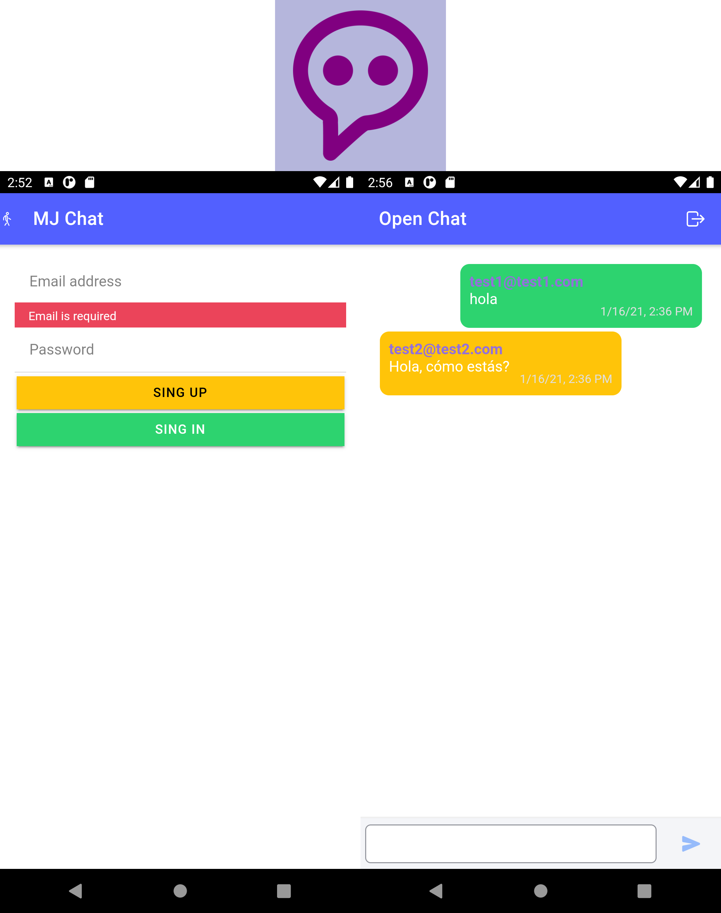

# :zap: App de Chat en Ionic con Firebase

App creada usando [Ionic framework](https://ionicframework.com/docs), usando una base de datos en la nube de firebase para almacenar los mensajes y usuarios de la app. Además, se integró capacitor para crear el apk.

## :page_facing_up: Tabla de contenidos

* [Información general](#general-info)
* [Screenshots](#screenshots)
* [Technologías](#technologias)
* [Disposición](#Disposición)
* [Caracrerísticas](#características)
* [Inspiración](#inspiración)
* [Contacto](#contacto)

## :books: Información general
#Librerías en el servidor
* import { Injectable } from '@angular/core';
* import { AngularFireAuth } from '@angular/fire/auth';
* import { AngularFirestore } from '@angular/fire/firestore';
* import firebase from 'firebase/app';
* import { switchMap, map } from 'rxjs/operators';
* import { Observable } from 'rxjs';
* import * as CryptoJS from 'crypto-js';

#Funcionamiento
* El funcionamiento es simple un login y chat
* Los mensaje son cifrados para garantizar fiabilidad y seguridad
* De la misma manera las contraseñas de los usuarios son cifradas para una mejor confiabilidad.

#Explicación de funcionamiento
* Los detalles del funcionamiento se encuntran explicados en el video.
* [Ver video](https://youtu.be/K4nU4qRKpHg)

## :camera: Screenshots

## :signal_strength: Tecnologías

* [Ionic/angular v5.5.2](https://ionicframework.com/)
* [Ionic v6.12.3](https://ionicframework.com/)
* [Firebase cloudstore v8.2.2](https://firebase.google.com/)
* [Capacitor v2.4.6](https://capacitorjs.com/)

## :floppy_disk: Disposición

* Correr el servidor en _localhost://8100_ ejecutando: 'ionic serve'
* Descargar APK

## :cool: Características

**Formulario de registro e inicio de sesión:**

* Registrarse: Click en Sing up.
* Iniciar Sesión: Click en Sing in.
* La contraseña del usuario sera almacenada cifrada.

**Envío de mensajes:**
* Enviar mensaje: Formulario y botón para el envío.
* Los mensajes serán almacenados cifrados.

